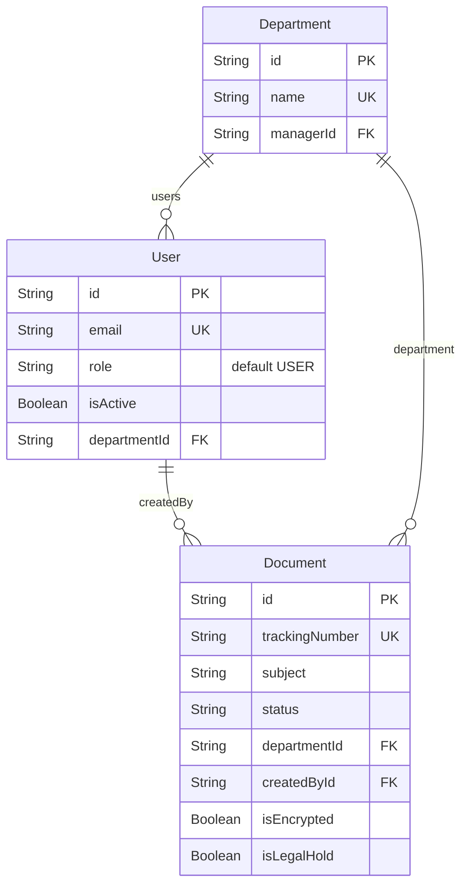

!!! tip "مخطط ERD التفصيلي"
    للاطلاع على مخطط ERD الكامل مع جميع العلاقات وتحليل الجداول، راجع صفحة [مخطط ERD التفصيلي](erd.md).

# مخطط قاعدة البيانات (Database Schema)

يعتمد نظام واثق على قاعدة بيانات `PostgreSQL` ويتم التعامل والتخاطب معها عبر `Prisma ORM`. 

## إحصائيات قاعدة البيانات

| البند | العدد |
|-------|-------|
| جداول (Models) | 27 |
| تعدادات (Enums) | 4 |
| إجمالي العلاقات | 40+ |
| فهارس (Indexes) | 30+ |

## المخطط المختصر — الجداول الأساسية

## الجداول الأساسية (Core Tables)

### 1. `User` (المستخدمون)
يحتوي على بيانات المستخدمين وصلاحياتهم الأساسية.
- `role`: يحدد مستوى الصلاحية (مثل: ADMIN, MANAGER, USER, VIEWER).
- `departmentId`: يربط المستخدم بقسم معين لمعالجة الإحالات الداخلية وصلاحيات العرض.

### 2. `Document` (الوثائق)
الجدول المركزي في النظام، يحفظ كل معاملة ورقية أو رقمية مدخلة في النظام.
- `type`: يحدد نوع الوثيقة (INCOMING وارد, OUTGOING صادر, INTERNAL داخلي).
- `status`: حالة المعاملة (PENDING قيد الانتظار, REVIEW قيد المراجعة, APPROVED مكتملة, ARCHIVED مؤرشفة, إلخ).
- `textContent`: *(مهم جداً للبحث المتقدم)* النص المستخرج بواسطة الـ OCR من المرفقات. يعتمد هذا الحقل على GIN index لتسريع عملية البحث الشامل (FTS).

### 3. `Attachment` (المرفقات)
يرتبط بجدول الوثائق `Document` بعلاقة بـ واحد إلى متعدد (One-to-Many).
- `fileUrl`: مسار ومكان حفظ الملف الفعلي على الخادم التخزيني.
- `metadata`: بيانات إضافية تشمل عدد الصفحات والتنسيق ونتائج مسح الفيروسات.
- `hasTextExtracted`: مؤشر يوضح هل تم إرسال الملف لـ Worker الـ OCR لاستخراج النص أم لا.

### 4. `Category` & `Department`
- **Category:** يُستخدم للتصنيف الموضوعي للوثيقة (مثل: مالي، إداري، هندسي.. إلخ)، ويدعم بناء التصنيفات الفرعية.
- **Department:** هيكل وأسماء الأقسام داخل المؤسسة للتعامل مع الإحالات والصلاحيات المتبادلة الداخلية.

### 5. `DisposalCertificate` & `DisposalRecord`
جداول مخصصة لحفظ وتوثيق عمليات الإتلاف الآمن للوثائق والمرفقات بشكل قانوني متسلسل.
- `pdfUrl`: مسار شهادة إتلاف الـ PDF الموقعة إلكترونيًا، والتي تحتوي على تفاصيل الوثيقة المهملة وتاريخ قرار التخلص منها وسببه.

## المرفقات المشفرة (Encrypted Storage)
لضمان أقصى معايير السرية للقطاعات الحساسة، يمكن تفعيل خيار الحفظ المشفر بوضع علامة `isEncrypted=true` على مستوى الملف. يسفر تفعيل هذا الخيار عن منع محركات البحث الداخلية (FTS) من الفهرسة، كما يمنع المستخدمين العاديين من فتح البيانات التابعة إلا بواسطة إدخال كلمة المرور المخصصة والمختلفة للملف السري (Vault Password).

![اقتراح صورة: أيقونات تمثيلية للجداول مثل جدول Users و Documents مع أسهم توضح العلاقات]
