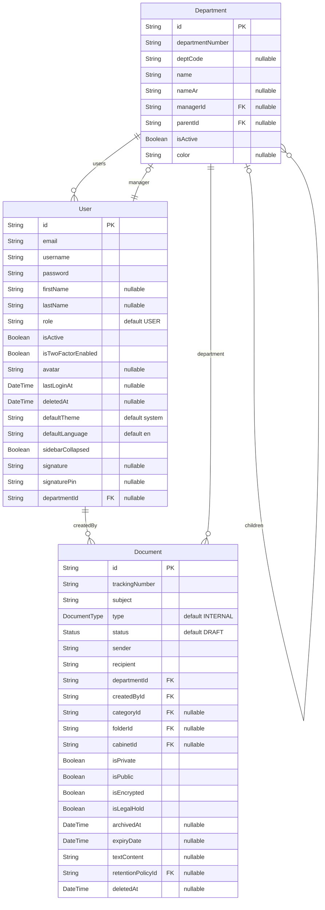
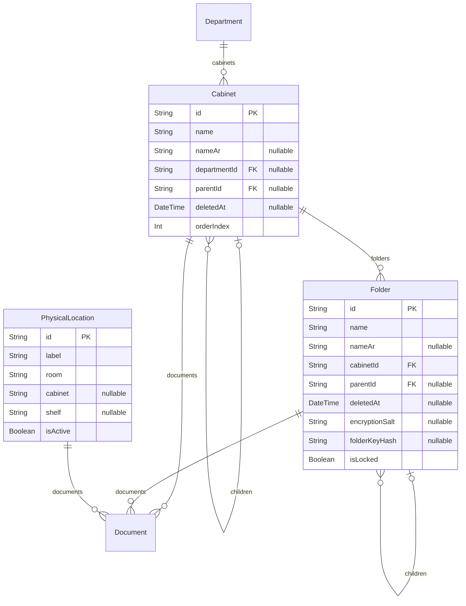
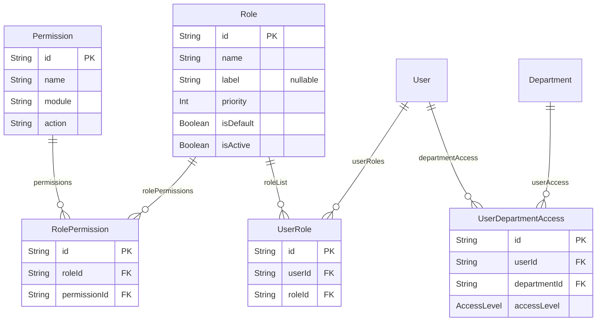
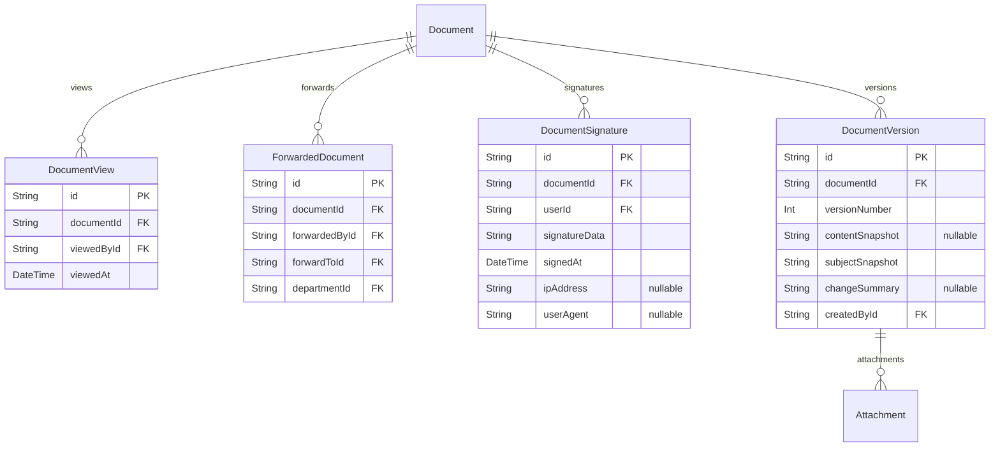
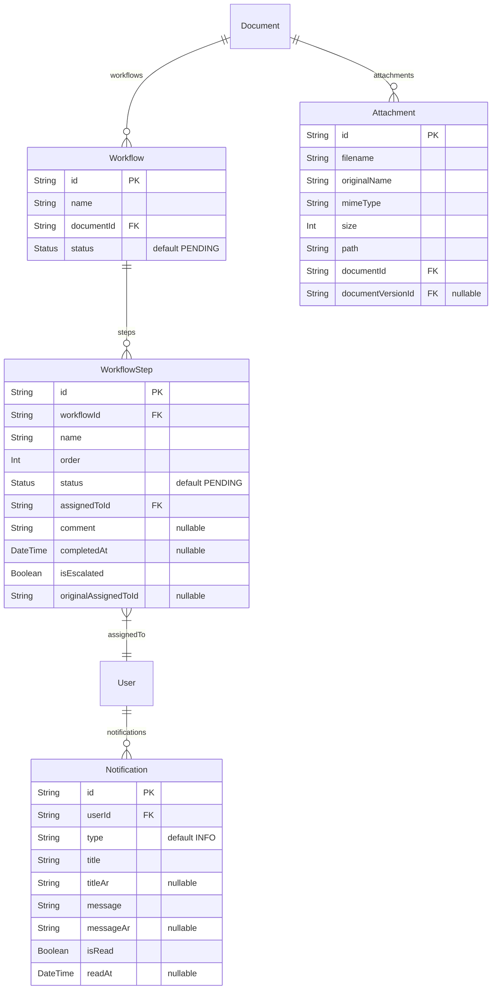
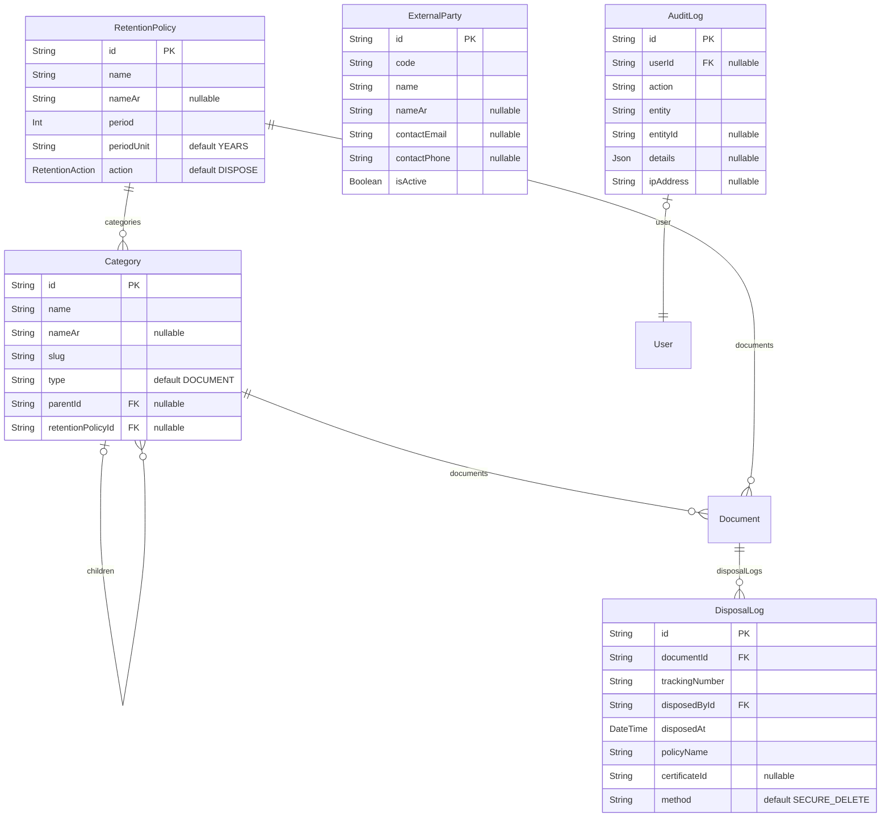

# مخطط ERD التفصيلي — قاعدة بيانات واثق

> **المصدر**: `backend/prisma/schema.prisma` | **إجمالي النماذج**: 27 Model + 4 Enum | **قاعدة البيانات**: PostgreSQL

---

## نظرة سريعة — إحصائيات قاعدة البيانات

| البند                 | العدد |
| --------------------- | ----- |
| Models (جداول)        | 27    |
| Enums                 | 4     |
| Self Relations        | 5     |
| One-to-One Relations  | 2     |
| One-to-Many Relations | 30+   |
| Many-to-Many (Pivot)  | 3     |
| Unique Constraints    | 15+   |
| فهارس (Indexes)       | 30+   |

---

## 3. التخزين — الخزائن والمجلدات والمواقع الفعلية

---

## 4. الصلاحيات والأدوار

---

## 5. تتبع الوثائق — المشاهدات والتحويلات والتواقيع والإصدارات

---

## 6. سير العمل والمرفقات والإشعارات

---

## 7. التصنيف والاحتفاظ والجهات الخارجية والتدقيق والإتلاف

---

## تحليل العلاقات

### علاقات ذاتية (Self Relations)

| النموذج      | العلاقة               | الوصف               |
| ------------ | --------------------- | ------------------- |
| `Department` | `DepartmentHierarchy` | هيكل هرمي للأقسام   |
| `Cabinet`    | `CabinetHierarchy`    | هيكل هرمي للخزائن   |
| `Folder`     | `FolderHierarchy`     | هيكل هرمي للمجلدات  |
| `Category`   | `CategoryHierarchy`   | هيكل هرمي للتصنيفات |
| `Document`   | `DocumentRelation`    | ربط الوثائق ببعضها  |

### علاقات Many-to-Many (عبر جداول وسيطة)

| الجدول الأيسر | الجدول الأيمن | الجدول الوسيط          |
| ------------- | ------------- | ---------------------- |
| `Role`        | `Permission`  | `RolePermission`       |
| `User`        | `Role`        | `UserRole`             |
| `User`        | `Department`  | `UserDepartmentAccess` |

---

## نقاط القوة التقنية

!!! success "مميزات تصميم قاعدة البيانات" - **UUID** — جميع المعرفات الأساسية من نوع UUID (تدعم التوزيع) - **Soft Delete** — User, Cabinet, Folder, Document تدعم `deletedAt` - **Full-Text Search** — حقل `textContent` مع GIN index - **Encryption Ready** — Folder: `encryptionSalt` + `folderKeyHash`، Document: `isEncrypted` - **MFA** — مصادقة ثنائية مع backup codes - **Audit Trail** — AuditLog يسجل action + entity + entityId + ipAddress - **Electronic Signature** — توقيع إلكتروني مع PIN + IP + User-Agent - **Legal Hold** — حماية الوثائق من الإتلاف أثناء التحقيقات

!!! warning "نقاط تحسين مقترحة" - **`User.role` (String)** — ازدواجية مع `UserRole`، يُقترح الاعتماد على الجدول الوسيط فقط - **`Category.allowedRoles` (String)** — يُقترح إنشاء جدول وسيط `CategoryRole` - **`DisposalLog.method` (String)** — يُقترح تحويله إلى Enum `DisposalMethod` - **`Attachment.size` (Int)** — يُقترح `BigInt` للملفات التي تتجاوز 2GB
