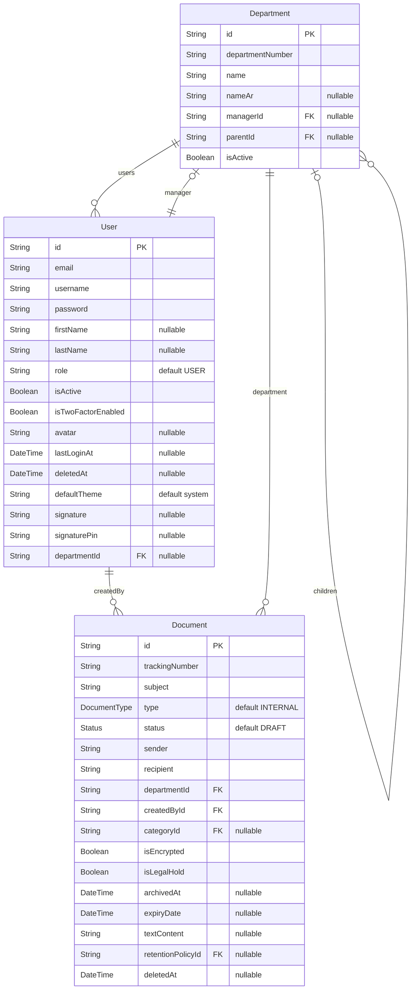
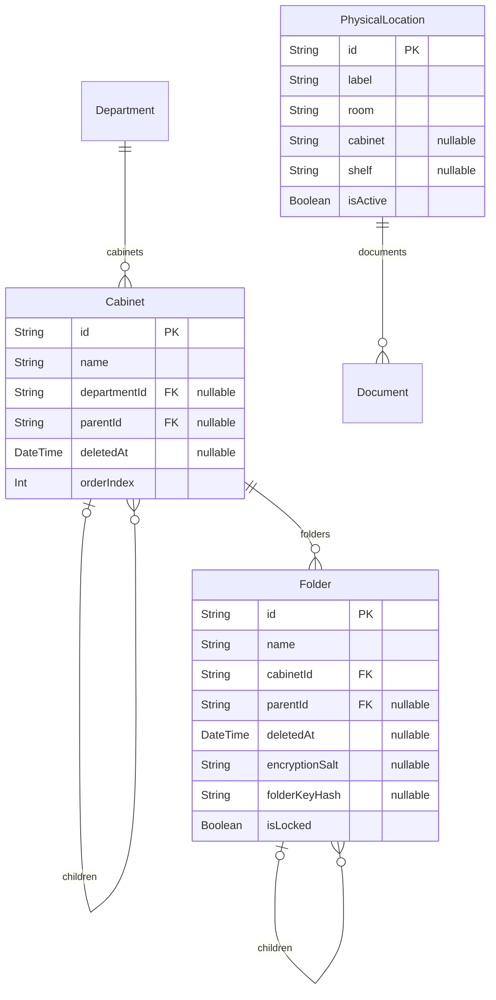
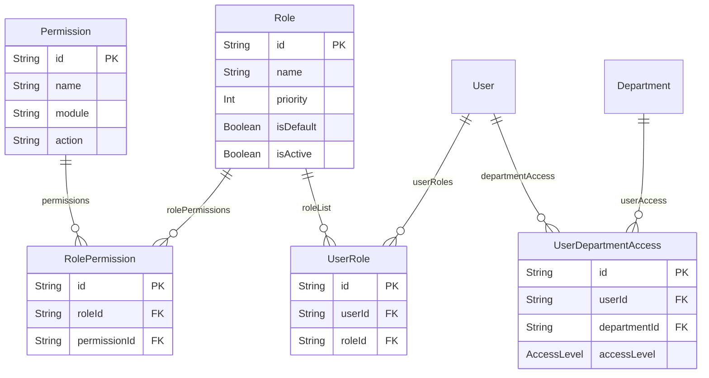
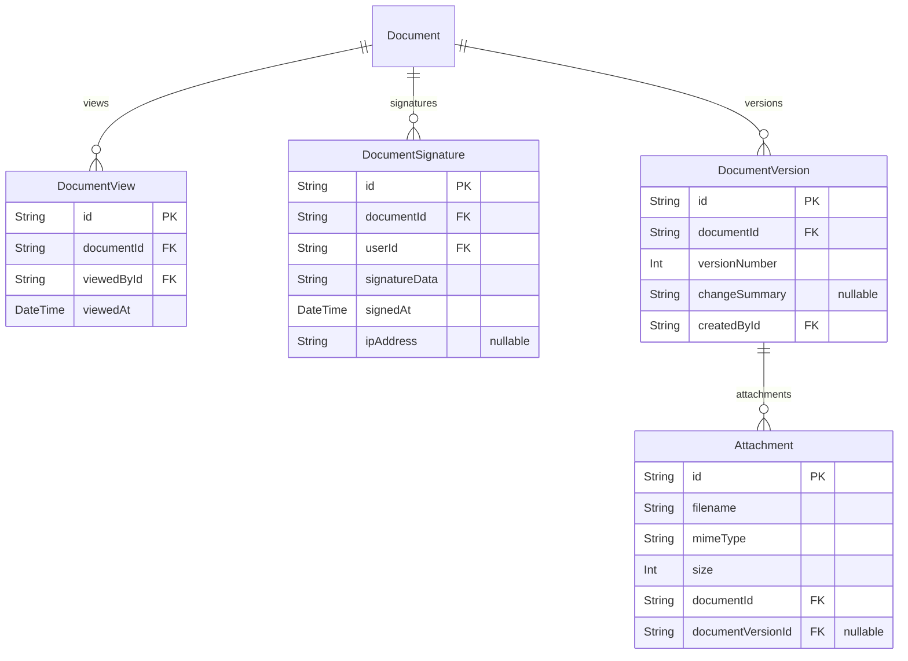
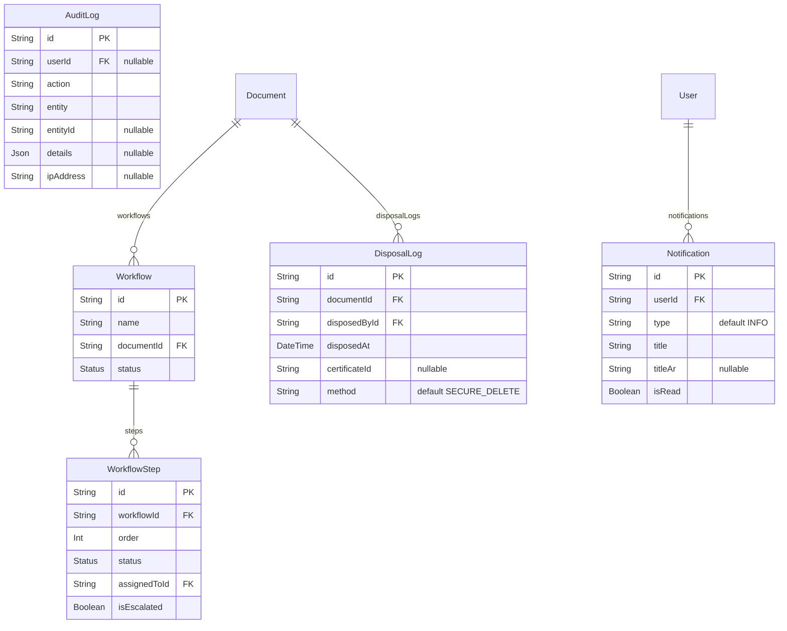

# ERD — Watheq Database Schema

> **Source**: `backend/prisma/schema.prisma` | **Total Models**: 27 + 4 Enums | **Database**: PostgreSQL

---

## Quick Stats

| Item                  | Count |
| --------------------- | ----- |
| Models (Tables)       | 27    |
| Enums                 | 4     |
| Self Relations        | 5     |
| One-to-One Relations  | 2     |
| One-to-Many Relations | 30+   |
| Many-to-Many (Pivot)  | 3     |
| Unique Constraints    | 15+   |
| Indexes               | 30+   |

---

## 3. Storage — Cabinet, Folder, PhysicalLocation

---

## 4. Access Control — Roles & Permissions

---

## 5. Document Tracking

---

## 6. Workflow, Notifications & Audit

---

## Relationship Summary

### Self Relations

| Model        | Relation Name         | Purpose                   |
| ------------ | --------------------- | ------------------------- |
| `Department` | `DepartmentHierarchy` | Nested department tree    |
| `Cabinet`    | `CabinetHierarchy`    | Nested cabinet tree       |
| `Folder`     | `FolderHierarchy`     | Nested folder tree        |
| `Category`   | `CategoryHierarchy`   | Nested category tree      |
| `Document`   | `DocumentRelation`    | Linking related documents |

### Many-to-Many (via Pivot Tables)

| Left   | Right        | Pivot                  |
| ------ | ------------ | ---------------------- |
| `Role` | `Permission` | `RolePermission`       |
| `User` | `Role`       | `UserRole`             |
| `User` | `Department` | `UserDepartmentAccess` |

---

## Design Highlights

!!! success "Database Design Strengths" - **UUIDs** — All primary keys are UUIDs for distribution support - **Soft Delete** — User, Cabinet, Folder, Document support `deletedAt` - **Full-Text Search** — `textContent` field with GIN index for FTS - **Encryption Ready** — Folders use `encryptionSalt` + `folderKeyHash` - **MFA** — Two-factor authentication with backup codes - **Audit Trail** — AuditLog records action + entity + entityId + ipAddress - **Electronic Signature** — Includes PIN, IP address, and User-Agent logging - **Legal Hold** — Protects documents from disposal during active investigations
