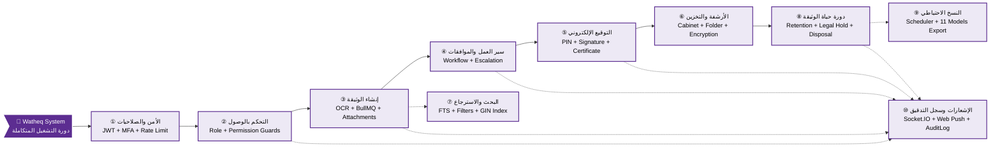
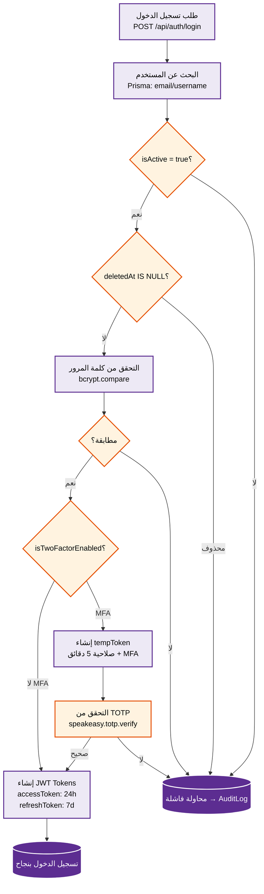
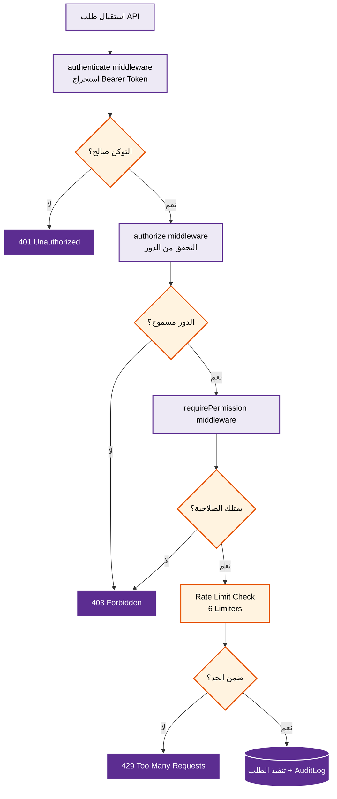
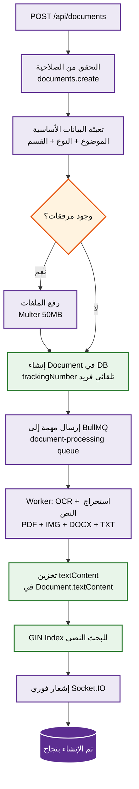
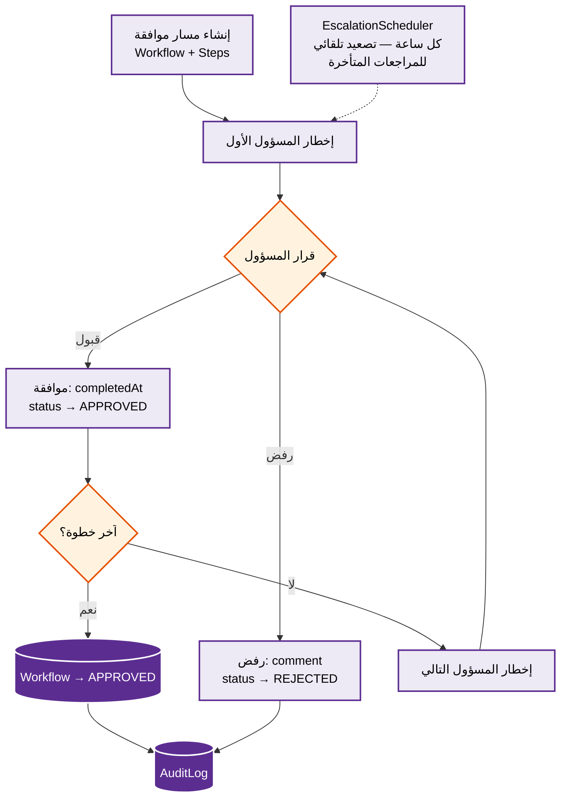
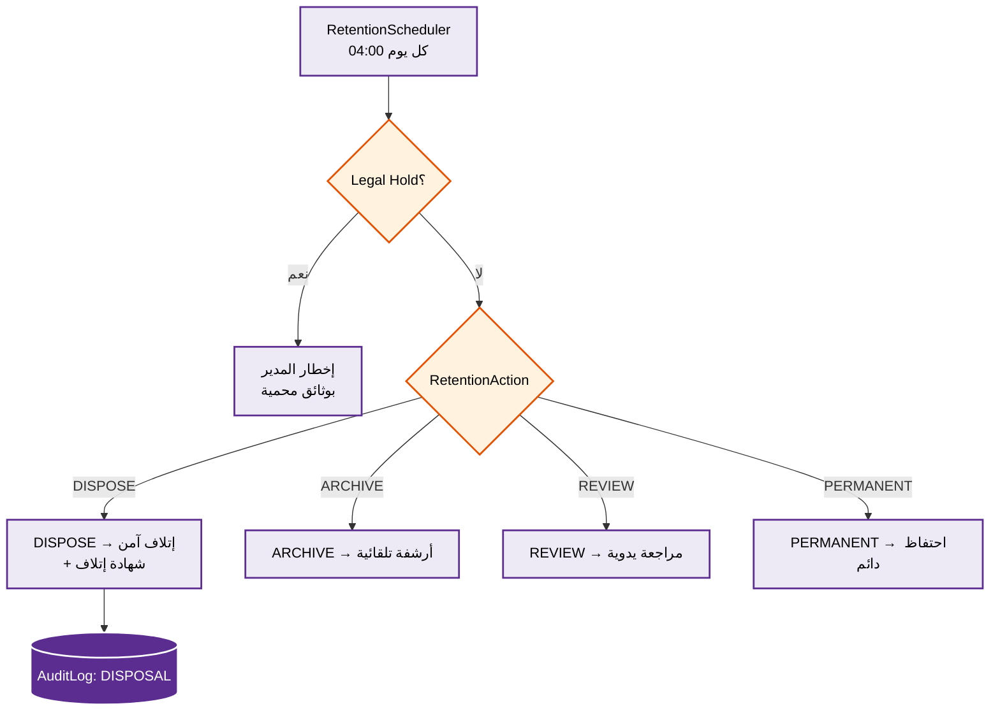

# المخططات التشغيلية — دورة التشغيل الكاملة

> **المصدر**: `backend/src/` — 24 Controller، 5 Middleware، 4 Service، 20 Utility، 2 Worker، 4 Scheduler

---

## نظرة عامة — المخطط العام للنظام

---

## جدول المراحل التشغيلية

| # | المرحلة | الملفات المصدرية | الوصف |
|---|---------|-----------------|-------|
| ① | **الأمن والصلاحيات** 🔐 | `auth.controller.ts`, `mfa.controller.ts` | JWT + MFA + bcrypt |
| ② | **التحكم بالوصول** 🛡️ | `middleware/auth.ts`, `middleware/rateLimit.middleware.ts` | RBAC + Rate Limit |
| ③ | **إنشاء الوثيقة** 📄 | `document.controller.ts`, `workers/documentWorker.ts` | OCR + BullMQ + FTS |
| ④ | **سير العمل والموافقات** 📋 | `workflow.controller.ts`, `services/escalation.service.ts` | Workflow + Escalation |
| ⑤ | **التوقيع الإلكتروني** ✍️ | `signature.controller.ts` | PIN + Signature + Certificate |
| ⑥ | **الأرشفة والتخزين** 🗂️ | `cabinet.controller.ts`, `folder.controller.ts` | Cabinet + Folder + AES-256-GCM |
| ⑦ | **البحث والاسترجاع** 🔍 | `search.controller.ts` | FTS GIN + 15 Filters |
| ⑧ | **دورة حياة الوثيقة** 🔄 | `retention.controller.ts`, `disposal.controller.ts` | Retention + Legal Hold + Disposal |
| ⑨ | **النسخ الاحتياطي** 💾 | `backup.controller.ts`, `utils/backup.scheduler.ts` | Scheduler + 11 Models JSON |
| ⑩ | **الإشعارات وسجل التدقيق** 📢 | `notification.controller.ts`, `audit.controller.ts` | Socket.IO + Web Push + AuditLog |

---

## المرحلة ①: الأمن والصلاحيات

---

## المرحلة ②: التحكم بالوصول (RBAC)

!!! info "معدلات تحديد الطلبات (Rate Limiters)"
    | الـ Limiter | الحد |
    |------------|------|
    | `generalLimiter` | 1000 req/15min |
    | `authLimiter` | 100 req/15min |
    | `loginLimiter` | 5 req/15min |
    | `createLimiter` | 200 req/min |
    | `searchLimiter` | 300 req/min |
    | `backupLimiter` | 5 req/hour |

---

## المرحلة ③: إنشاء الوثيقة

---

## المرحلة ④: سير العمل والموافقات

---

## المرحلة ⑧: دورة حياة الوثيقة

---

## الجداول الزمنية للمهام الخلفية

| المهمة | الوقت | المدة المتوقعة |
|--------|-------|----------------|
| النسخ الاحتياطي | 02:00 يومياً | ~2-5 دقائق |
| فحص الاحتفاظ | 04:00 يومياً | ~1-3 دقائق |
| تصعيد سير العمل | كل ساعة | ~30 ثانية |
| تقارير الأداء | الأحد 00:00 | ~5-10 دقائق |

---

## الـ 7 Modules المقترحة

| # | الـ Module | المحتوى | التبعيات |
|---|-----------|---------|---------|
| 1 | **Core** | User, Department, Organization, Settings | — |
| 2 | **Security** | Auth, MFA, RBAC, Rate Limit | Core |
| 3 | **Documents** | Document, Version, Signature, Forward | Core + Security |
| 4 | **Filing** | Cabinet, Folder, Physical, Category | Core + Documents |
| 5 | **Workflow** | Workflow, Escalation, Notification, Retention | Documents + Core |
| 6 | **Search** | FTS, OCR, AI, Filters | Documents |
| 7 | **Operations** | Audit, Backup, Analytics | All |
