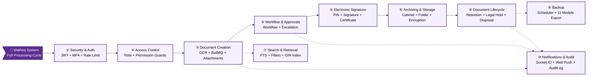
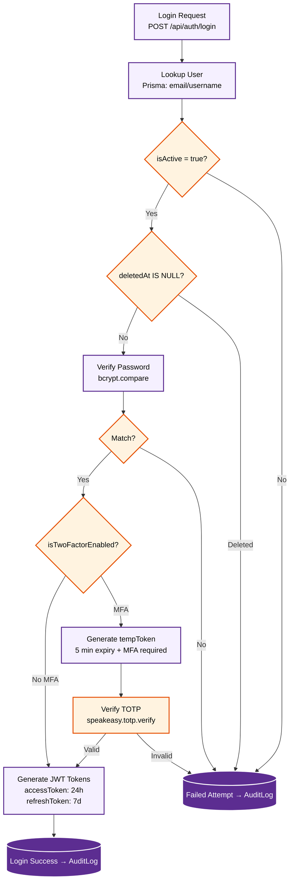
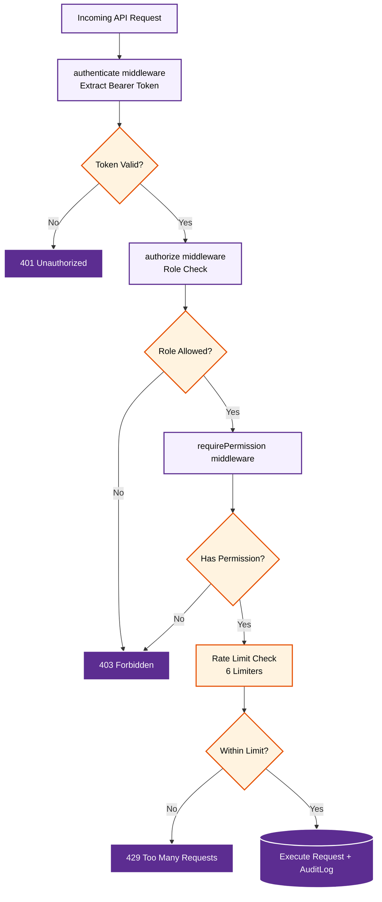

# Operational Flowcharts — System Processing Cycle

> **Source**: `backend/src/` — 24 Controllers, 5 Middleware, 4 Services, 20 Utilities, 2 Workers, 4 Schedulers

---

## System Overview Diagram

---

## 10 Operational Phases

| # | Phase | Source Files | Description |
|---|-------|-------------|-------------|
| ① | **Security & Auth** 🔐 | `auth.controller.ts`, `mfa.controller.ts` | JWT + MFA + bcrypt |
| ② | **Access Control** 🛡️ | `middleware/auth.ts`, `rateLimit.middleware.ts` | RBAC + Rate Limiting |
| ③ | **Document Creation** 📄 | `document.controller.ts`, `workers/documentWorker.ts` | OCR + BullMQ + FTS |
| ④ | **Workflow & Approvals** 📋 | `workflow.controller.ts`, `escalation.service.ts` | Multi-step approval + Auto-escalation |
| ⑤ | **Electronic Signature** ✍️ | `signature.controller.ts` | PIN + Signature + Certificate |
| ⑥ | **Archiving & Storage** 🗂️ | `cabinet.controller.ts`, `folder.controller.ts` | Cabinet + Folder + AES-256-GCM |
| ⑦ | **Search & Retrieval** 🔍 | `search.controller.ts` | FTS GIN + 15 Filters |
| ⑧ | **Document Lifecycle** 🔄 | `retention.controller.ts`, `disposal.controller.ts` | Retention + Legal Hold + Disposal |
| ⑨ | **Backup** 💾 | `backup.controller.ts`, `backup.scheduler.ts` | Daily scheduler + 11 Models JSON export |
| ⑩ | **Notifications & Audit** 📢 | `notification.controller.ts`, `audit.controller.ts` | Socket.IO + Web Push + AuditLog |

---

## Phase ①: Security & Authentication

---

## Phase ②: Access Control (RBAC)

!!! info "Rate Limiter Configuration"
    | Limiter | Limit |
    |---------|-------|
    | `generalLimiter` | 1000 req/15min |
    | `authLimiter` | 100 req/15min |
    | `loginLimiter` | 5 req/15min |
    | `createLimiter` | 200 req/min |
    | `searchLimiter` | 300 req/min |
    | `backupLimiter` | 5 req/hour |

---

## Background Job Schedule

| Job | Schedule | Expected Duration |
|-----|----------|------------------|
| Backup | Daily at 02:00 | ~2-5 minutes |
| Retention Check | Daily at 04:00 | ~1-3 minutes |
| Workflow Escalation | Every hour | ~30 seconds |
| Performance Reports | Sunday 00:00 | ~5-10 minutes |

---

## Proposed Module Architecture

| # | Module | Contents | Dependencies |
|---|--------|---------|--------------|
| 1 | **Core** | User, Department, Organization, Settings | — |
| 2 | **Security** | Auth, MFA, RBAC, Rate Limit | Core |
| 3 | **Documents** | Document, Version, Signature, Forward | Core + Security |
| 4 | **Filing** | Cabinet, Folder, Physical, Category | Core + Documents |
| 5 | **Workflow** | Workflow, Escalation, Notification, Retention | Documents + Core |
| 6 | **Search** | FTS, OCR, AI, Filters | Documents |
| 7 | **Operations** | Audit, Backup, Analytics | All |
