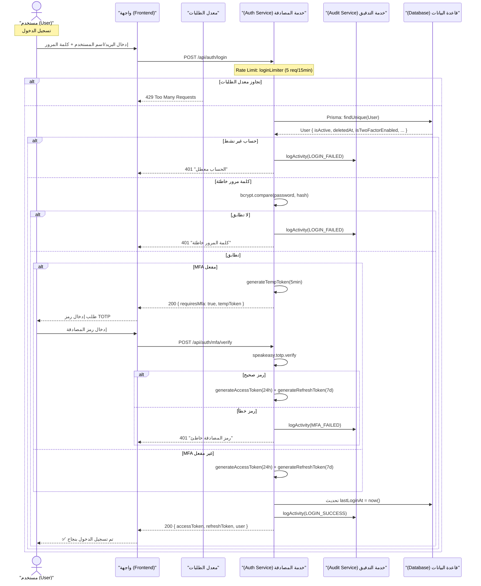
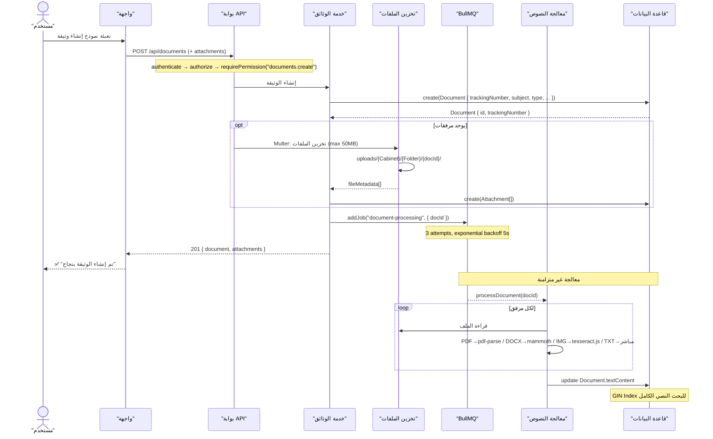
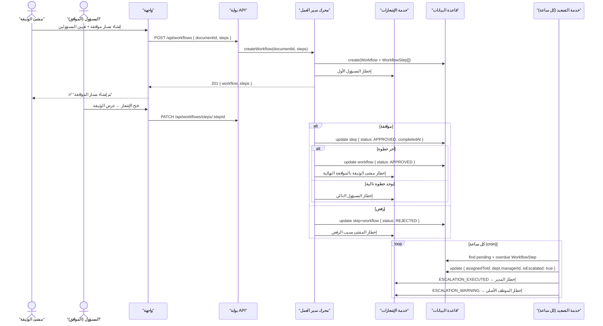
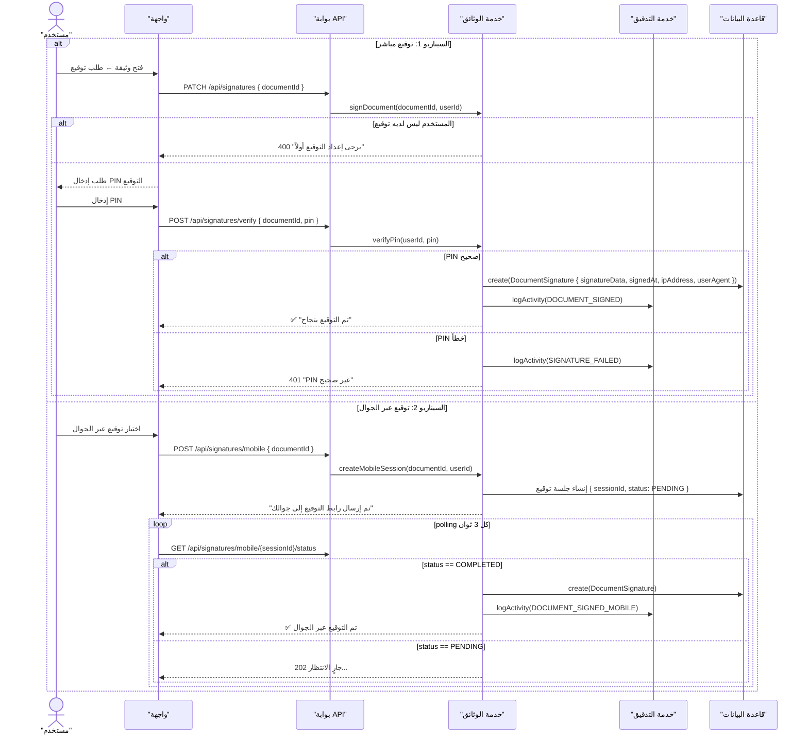
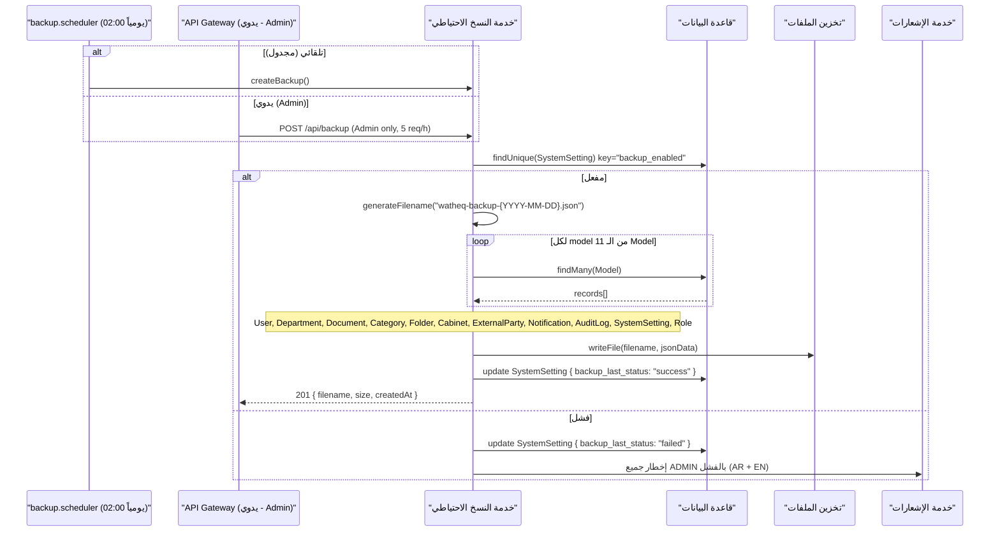
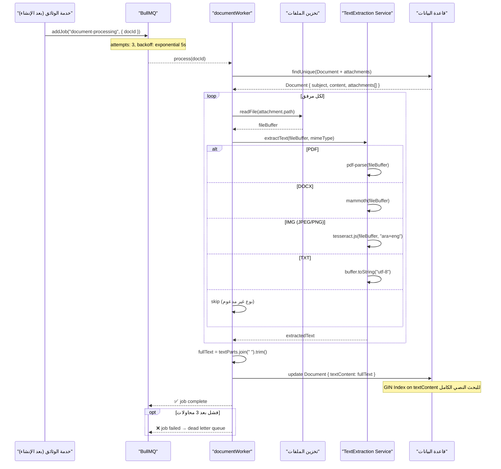

# مخططات التسلسل — Sequence Diagrams

> **إجمالي المخططات**: 15 مخطط | **الصيغة**: Mermaid sequenceDiagram | **المصدر**: `backend/src/` (24 Controller, 5 Middleware, 4 Service)

---

## فهرس المخططات

| #   | المخطط                                 | التعقيد    | المشاركون الرئيسيون          |
| --- | -------------------------------------- | ---------- | ---------------------------- |
| 1   | [تسجيل الدخول والمصادقة](#auth)        | ⭐⭐⭐     | User, AuthSvc, DB            |
| 2   | [إنشاء وثيقة جديدة](#create-doc)       | ⭐⭐⭐⭐   | User, DocSvc, OCR, BullMQ    |
| 3   | [رفع المرفقات](#upload)                | ⭐⭐⭐     | User, FileStore, DocSvc      |
| 4   | [أرشفة الوثيقة](#archive)              | ⭐⭐⭐     | User, DocSvc, FileStore      |
| 5   | [دورة الموافقات Workflow](#workflow)   | ⭐⭐⭐⭐⭐ | User×2, WfSvc, Escalation    |
| 6   | [البحث والاسترجاع](#search)            | ⭐⭐⭐     | User, SearchSvc, DB GIN      |
| 7   | [التوقيع الإلكتروني](#signature)       | ⭐⭐⭐⭐   | User, DocSvc, DB             |
| 8   | [إدارة الصلاحيات والأدوار](#roles)     | ⭐⭐⭐     | Admin, AuthSvc, DB           |
| 9   | [الإشعارات والتنبيهات](#notifications) | ⭐⭐⭐⭐   | NotifSvc, Socket.IO, WebPush |
| 10  | [النسخ الاحتياطي والاستعادة](#backup)  | ⭐⭐⭐     | BackupSvc, 11 Models, FS     |
| 11  | [سجل التدقيق Audit logs](#audit)       | ⭐⭐       | AuditSvc ← جميع الخدمات      |
| 12  | [مشاركة الوثائق](#share)               | ⭐⭐⭐     | User×2, DocSvc, NotifSvc     |
| 13  | [معالجة OCR](#ocr)                     | ⭐⭐⭐⭐   | BullMQ, Worker, OCR, DB      |
| 14  | [تصنيف الوثائق وفهرستها](#classify)    | ⭐⭐⭐     | User, DocSvc, DB             |
| 15  | [تصدير وطباعة الوثائق](#export)        | ⭐⭐       | User, DocSvc, FileStore      |

---

## 1. تسجيل الدخول والمصادقة

---

## 2. إنشاء وثيقة جديدة

---

## 5. دورة الموافقات Workflow

---

## 7. التوقيع الإلكتروني

---

## 10. النسخ الاحتياطي والاستعادة

---

## 13. معالجة OCR

---

## جدول الأحداث الحرجة

| الحدث            | يُسجل Audit؟         | إشعار مطلوب؟       | غير متزامن؟  |
| ---------------- | -------------------- | ------------------ | ------------ |
| تسجيل دخول ناجح  | ✅ LOGIN_SUCCESS     | ❌                 | ❌           |
| إنشاء وثيقة      | ✅ CREATE_DOCUMENT   | ✅                 | ✅ OCR       |
| موافقة Workflow  | ✅ WORKFLOW_APPROVED | ✅                 | ❌           |
| رفض Workflow     | ✅ WORKFLOW_REJECTED | ✅                 | ❌           |
| تصعيد Workflow   | ✅ ESCALATION        | ✅ المدير + الموظف | ✅ كل ساعة   |
| توقيع وثيقة      | ✅ DOCUMENT_SIGNED   | ✅                 | ❌           |
| إتلاف وثيقة      | ✅ DISPOSAL          | ✅ المشرف          | ✅ Retention |
| نسخ احتياطي ناجح | ✅ BACKUP_SUCCESS    | ❌                 | ✅ مجدول     |
| فشل نسخ احتياطي  | ✅ BACKUP_FAILED     | ✅ جميع ADMIN      | ✅           |

!!! note "المخططات المكتملة"
المخططات 3، 4، 6، 8، 9، 11، 12، 14، 15 موجودة في الملفات المصدرية `docs/sequence-diagrams/` وتحتوي على تفاصيل كاملة لكل عملية.
