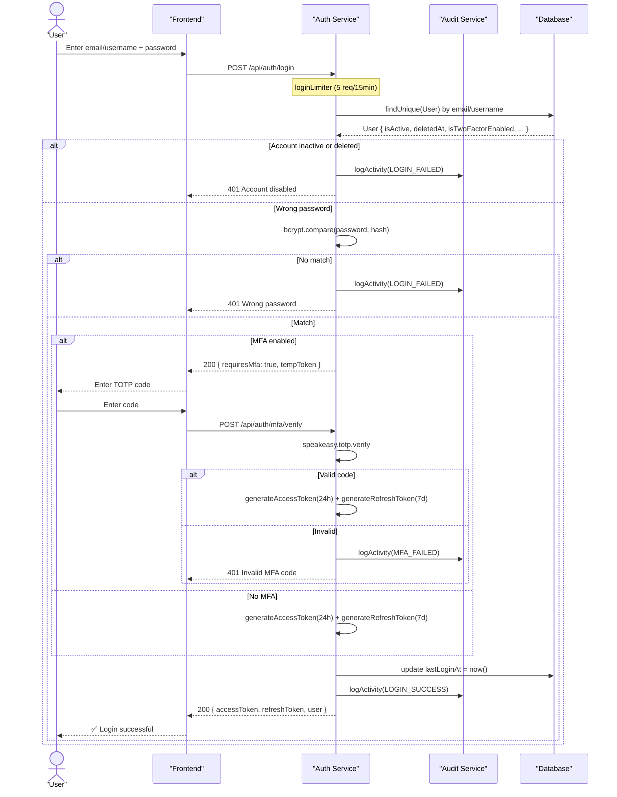
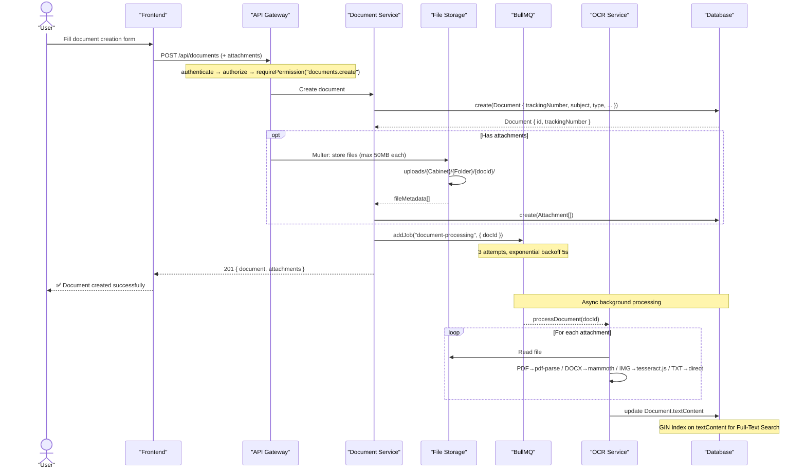
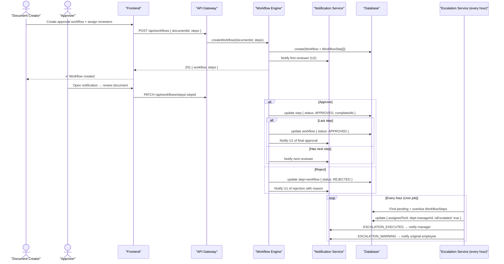
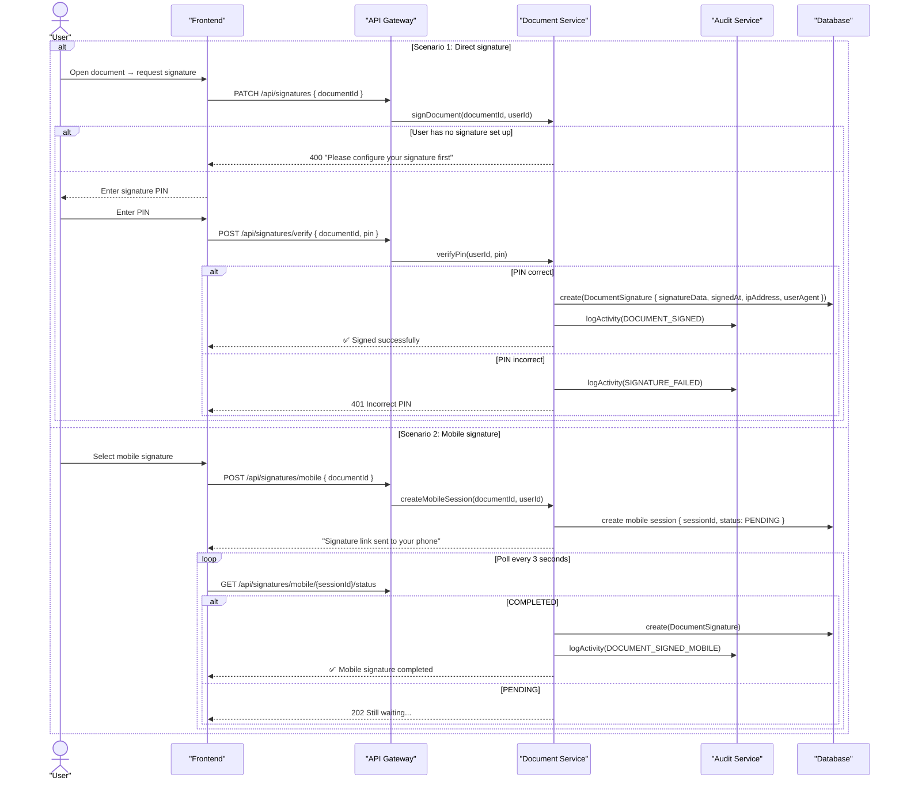
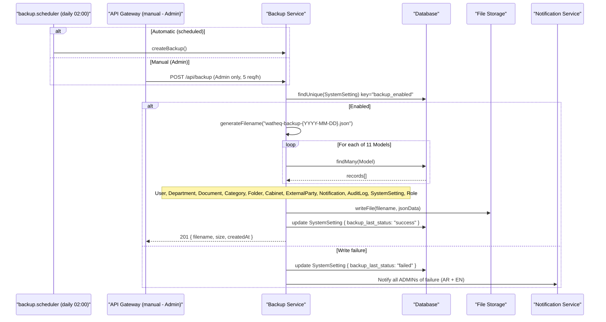
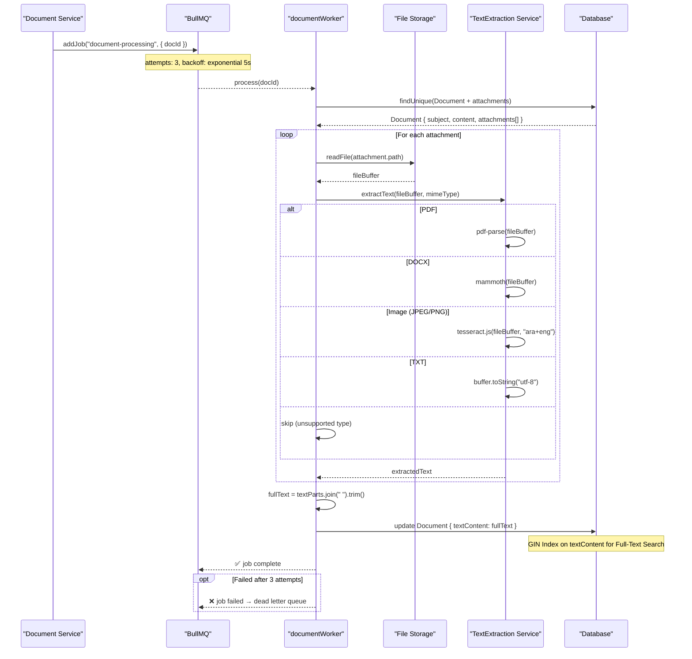

# Sequence Diagrams — System Interaction Flows

> **Total Diagrams**: 15 | **Format**: Mermaid sequenceDiagram | **Source**: `backend/src/` (24 Controllers, 5 Middleware, 4 Services)

---

## Diagram Index

| # | Diagram | Complexity | Key Participants |
|---|---------|-----------|----------------|
| 1 | [Login & Authentication](#auth) | ⭐⭐⭐ | User, AuthSvc, DB |
| 2 | [Create Document](#create-doc) | ⭐⭐⭐⭐ | User, DocSvc, OCR, BullMQ |
| 3 | Upload Attachments | ⭐⭐⭐ | User, FileStore, DocSvc |
| 4 | Archive Document | ⭐⭐⭐ | User, DocSvc, FileStore |
| 5 | [Workflow Approval](#workflow) | ⭐⭐⭐⭐⭐ | User×2, WfSvc, Escalation |
| 6 | Search & Retrieval | ⭐⭐⭐ | User, SearchSvc, DB GIN |
| 7 | [Electronic Signature](#signature) | ⭐⭐⭐⭐ | User, DocSvc, DB |
| 8 | Roles & Permissions | ⭐⭐⭐ | Admin, AuthSvc, DB |
| 9 | Notifications & Alerts | ⭐⭐⭐⭐ | NotifSvc, Socket.IO, WebPush |
| 10 | [Backup & Restore](#backup) | ⭐⭐⭐ | BackupSvc, 11 Models, FS |
| 11 | Audit Log | ⭐⭐ | AuditSvc ← All Services |
| 12 | Document Sharing | ⭐⭐⭐ | User×2, DocSvc, NotifSvc |
| 13 | [OCR Processing](#ocr) | ⭐⭐⭐⭐ | BullMQ, Worker, OCR, DB |
| 14 | Document Classification | ⭐⭐⭐ | User, DocSvc, DB |
| 15 | Export & Print | ⭐⭐ | User, DocSvc, FileStore |

---

## 1. Login & Authentication

---

## 2. Create Document

---

## 5. Workflow Approval

---

## 7. Electronic Signature

---

## 10. Backup & Restore

---

## 13. OCR Processing

---

## Critical Events Reference

| Event | Audit Log | Notification | Async? |
|-------|-----------|-------------|--------|
| Successful Login | ✅ LOGIN_SUCCESS | ❌ | ❌ |
| Document Creation | ✅ CREATE_DOCUMENT | ✅ | ✅ OCR |
| Workflow Approval | ✅ WORKFLOW_APPROVED | ✅ | ❌ |
| Workflow Rejection | ✅ WORKFLOW_REJECTED | ✅ | ❌ |
| Workflow Escalation | ✅ ESCALATION | ✅ Manager + Employee | ✅ hourly |
| Document Signing | ✅ DOCUMENT_SIGNED | ✅ | ❌ |
| Document Disposal | ✅ DISPOSAL | ✅ Supervisor | ✅ Retention |
| Backup Success | ✅ BACKUP_SUCCESS | ❌ | ✅ scheduled |
| Backup Failure | ✅ BACKUP_FAILED | ✅ All ADMINs | ✅ |
